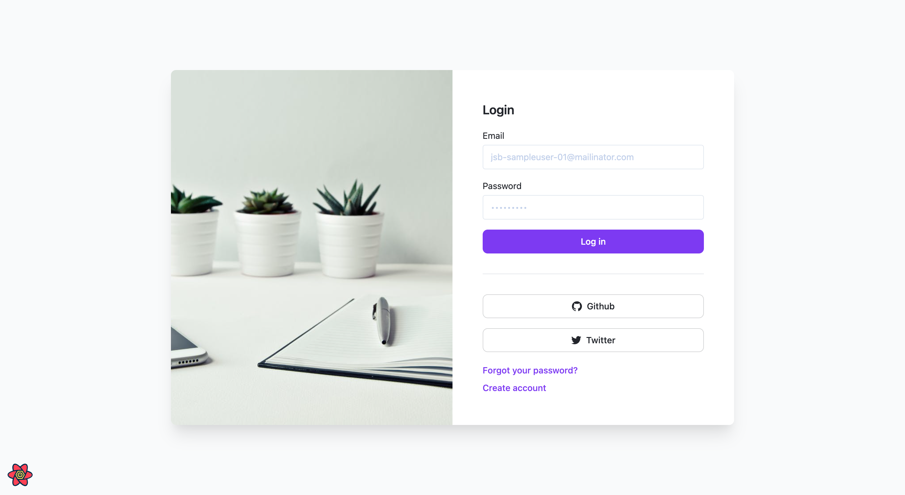

Support:

- dotenv-vault
- solidjs
- storybook
- ui kit (https://www.figma.com/community/file/1035203688168086460)
- custom fonts

- Demo
  

Further help:

- https://www.dotenv.org/
- https://www.solidjs.com/
- https://storybook.js.org/blog/first-class-vite-support-in-storybook/
- https://www.figma.com/community/file/1067847732339602315
- https://www.figma.com/community/file/1108126447116535154
- https://www.figma.com/community/file/928108847914589057
- https://blog.logrocket.com/how-to-use-custom-fonts-tailwind-css/
- https://github.com/jasonkuhrt/graphql-request/tree/main/examples
- https://www.codecademy.com/learn/learn-typescript/modules/learn-typescript-advanced-object-types/cheatsheet
